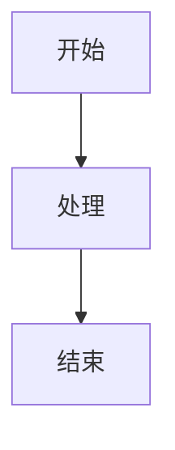

# API文档

LAD Markdown Viewer包的公共API接口文档。

## 核心模块

### markdown_processor.py

#### MarkdownProcessor类

主要的Markdown处理类，提供完整的Markdown到HTML转换功能。

```python
class MarkdownProcessor:
    def __init__(self):
        """初始化Markdown处理器"""
```

##### 方法

###### process_markdown(md_text: str) -> str
将Markdown文本转换为HTML。

**参数:**
- `md_text` (str): 输入的Markdown文本

**返回:**
- `str`: 完整的HTML文档字符串

**示例:**
```python
from lad_markdown_viewer.markdown_processor import MarkdownProcessor

processor = MarkdownProcessor()
html = processor.process_markdown("# Hello World")
```

###### render_markdown_to_html(md_text: str) -> str
静态方法，直接渲染Markdown到HTML。

**参数:**
- `md_text` (str): 输入的Markdown文本

**返回:**
- `str`: 完整的HTML文档字符串

**示例:**
```python
from lad_markdown_viewer.markdown_processor import render_markdown_to_html

html = render_markdown_to_html("# Hello World")
```

### markdown_utils.py

#### 工具函数

##### process_mermaid_diagrams(html_content: str) -> str
处理HTML内容中的Mermaid图表。

**参数:**
- `html_content` (str): 包含Mermaid代码块的HTML内容

**返回:**
- `str`: 处理后的HTML内容，Mermaid代码块被转换为图表

**示例:**
```python
from lad_markdown_viewer.markdown_utils import process_mermaid_diagrams

html_with_mermaid = process_mermaid_diagrams(html_content)
```

##### slugify(text: str) -> str
将文本转换为URL友好的slug。

**参数:**
- `text` (str): 输入文本

**返回:**
- `str`: URL友好的slug字符串

**示例:**
```python
from lad_markdown_viewer.markdown_utils import slugify

slug = slugify("Hello World!")  # 返回 "hello-world"
```

### ladmark_viewer.py

#### LadMark类

基于PyQt5的Markdown查看器窗口类。

```python
class LadMark(QMainWindow):
    def __init__(self, markdown_file_path: str = None):
        """
        初始化Markdown查看器窗口
        
        参数:
            markdown_file_path (str, optional): Markdown文件路径
        """
```

##### 方法

###### load_markdown_file(file_path: str)
加载并显示Markdown文件。

**参数:**
- `file_path` (str): Markdown文件路径

**示例:**
```python
from lad_markdown_viewer.ladmark_viewer import LadMark

viewer = LadMark()
viewer.load_markdown_file("document.md")
```

###### set_markdown_content(content: str)
设置Markdown内容。

**参数:**
- `content` (str): Markdown文本内容

**示例:**
```python
viewer = LadMark()
viewer.set_markdown_content("# Hello World")
```

## 使用示例

### 基本使用

```python
from lad_markdown_viewer.markdown_processor import MarkdownProcessor

# 创建处理器
processor = MarkdownProcessor()

# 处理Markdown
markdown_text = """
---
title: 示例文档
author: 作者名
---

# 标题
这是正文内容。

## 子标题
- 列表项1
- 列表项2
"""

html_output = processor.process_markdown(markdown_text)
print(html_output)
```

### 桌面应用使用

```python
import sys
from PyQt5.QtWidgets import QApplication
from lad_markdown_viewer.ladmark_viewer import LadMark

if __name__ == '__main__':
    app = QApplication(sys.argv)
    
    # 创建查看器并加载文件
    viewer = LadMark("example.md")
    viewer.show()
    
    sys.exit(app.exec_())
```

### 自定义处理

```python
from lad_markdown_viewer.markdown_processor import MarkdownProcessor
from lad_markdown_viewer.markdown_utils import process_mermaid_diagrams

# 自定义处理流程
processor = MarkdownProcessor()

# 处理包含Mermaid的Markdown
markdown_with_mermaid = """
# 流程图示例


"""

html = processor.process_markdown(markdown_with_mermaid)
# Mermaid图表会自动被处理并渲染
```

## 配置选项

### CSS样式自定义

可以通过修改`markdown_processor.py`中的CSS样式来自定义输出外观：

```python
# 在MarkdownProcessor类中修改CSS_STYLE变量
CSS_STYLE = """
<style>
    /* 自定义样式 */
    body { font-family: 'Arial', sans-serif; }
    h1 { color: #333; }
    /* 更多样式... */
</style>
"""
```

### Mermaid主题配置

Mermaid图表支持多种主题，可以在CSS中配置：

```css
/* 在CSS中添加Mermaid主题配置 */
.mermaid {
    background-color: #f5f5f5;
    border-radius: 5px;
    padding: 10px;
}
```

## 错误处理

### 常见错误

1. **导入错误**: 确保正确安装了所有依赖包
2. **文件路径错误**: 检查文件路径是否正确
3. **编码错误**: 确保文件使用UTF-8编码

### 异常处理

```python
try:
    processor = MarkdownProcessor()
    html = processor.process_markdown(markdown_content)
except Exception as e:
    print(f"处理Markdown时出错: {e}")
```

## 版本兼容性

- Python 3.7+
- PyQt5 5.15+
- mistune 2.0+

---

**最后更新**：2025-06-21 19:47 