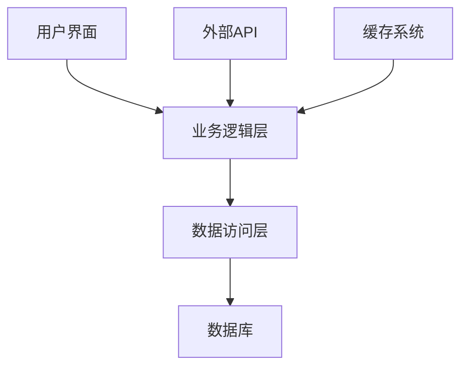
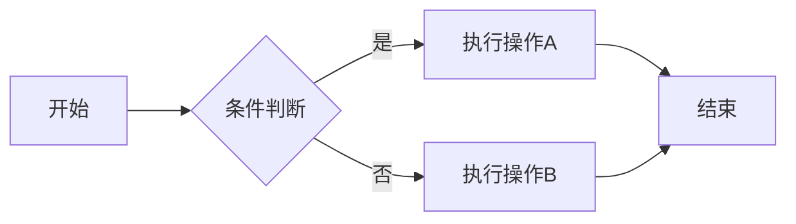

# 使用示例

本文档提供了LAD Markdown Viewer包的详细使用示例。

## 基础示例

### 1. 简单的Markdown渲染

```python
from lad_markdown_viewer.markdown_processor import MarkdownProcessor

# 创建处理器
processor = MarkdownProcessor()

# 简单的Markdown文本
markdown_text = """
# 欢迎使用LAD Markdown Viewer

这是一个简单的示例文档。

## 功能特性

- 支持标准Markdown语法
- YAML前置元数据解析
- Mermaid图表渲染
- 可点击目录导航

## 代码示例

```python
print("Hello, World!")
```
"""

# 转换为HTML
html_output = processor.process_markdown(markdown_text)
print(html_output)
```

### 2. 带YAML前置元数据的文档

```python
markdown_with_yaml = """
---
title: 项目文档
author: 张三
version: 1.0.0
date: 2025-06-21
tags: [文档, 示例, 教程]
---

# 项目文档

这是项目的主要文档。

## 项目概述

项目描述内容...

## 安装说明

1. 克隆仓库
2. 安装依赖
3. 运行应用
"""

html = processor.process_markdown(markdown_with_yaml)
```

### 3. 包含Mermaid图表的文档

```python
markdown_with_mermaid = """
# 系统架构图

以下是系统的整体架构：



## 流程图示例


"""

html = processor.process_markdown(markdown_with_mermaid)
```

## 桌面应用示例

### 1. 基本桌面应用

```python
import sys
from PyQt5.QtWidgets import QApplication
from lad_markdown_viewer.ladmark_viewer import LadMark

def main():
    app = QApplication(sys.argv)
    
    # 创建查看器
    viewer = LadMark()
    viewer.setWindowTitle("LAD Markdown Viewer")
    viewer.resize(800, 600)
    
    # 加载Markdown内容
    content = """
    # 桌面应用示例
    
    这是一个桌面应用的示例。
    
    ## 功能
    
    - 实时预览
    - 文件加载
    - 导出功能
    """
    
    viewer.set_markdown_content(content)
    viewer.show()
    
    sys.exit(app.exec_())

if __name__ == '__main__':
    main()
```

### 2. 文件加载应用

```python
import sys
import os
from PyQt5.QtWidgets import QApplication, QFileDialog, QMessageBox
from lad_markdown_viewer.ladmark_viewer import LadMark

class MarkdownViewerApp:
    def __init__(self):
        self.app = QApplication(sys.argv)
        self.viewer = LadMark()
        self.setup_ui()
    
    def setup_ui(self):
        self.viewer.setWindowTitle("LAD Markdown Viewer - 文件浏览器")
        self.viewer.resize(1000, 700)
        
        # 添加菜单栏
        menubar = self.viewer.menuBar()
        file_menu = menubar.addMenu('文件')
        
        # 打开文件动作
        open_action = file_menu.addAction('打开文件')
        open_action.triggered.connect(self.open_file)
        
        # 退出动作
        exit_action = file_menu.addAction('退出')
        exit_action.triggered.connect(self.app.quit)
    
    def open_file(self):
        file_path, _ = QFileDialog.getOpenFileName(
            self.viewer,
            "选择Markdown文件",
            "",
            "Markdown Files (*.md *.markdown);;All Files (*)"
        )
        
        if file_path:
            try:
                with open(file_path, 'r', encoding='utf-8') as f:
                    content = f.read()
                self.viewer.set_markdown_content(content)
                self.viewer.setWindowTitle(f"LAD Markdown Viewer - {os.path.basename(file_path)}")
            except Exception as e:
                QMessageBox.critical(self.viewer, "错误", f"无法打开文件: {str(e)}")
    
    def run(self):
        self.viewer.show()
        return self.app.exec_()

if __name__ == '__main__':
    app = MarkdownViewerApp()
    sys.exit(app.run())
```

## Web应用示例

### 1. Flask Web应用

```python
from flask import Flask, render_template_string, request, jsonify
from lad_markdown_viewer.markdown_processor import MarkdownProcessor

app = Flask(__name__)
processor = MarkdownProcessor()

# HTML模板
HTML_TEMPLATE = """
<!DOCTYPE html>
<html>
<head>
    <title>LAD Markdown Viewer</title>
    <meta charset="utf-8">
    <style>
        body { font-family: Arial, sans-serif; margin: 20px; }
        .container { max-width: 1200px; margin: 0 auto; }
        .input-area { width: 100%; height: 300px; margin-bottom: 20px; }
        .output-area { border: 1px solid #ccc; padding: 20px; min-height: 400px; }
    </style>
</head>
<body>
    <div class="container">
        <h1>LAD Markdown Viewer</h1>
        <textarea id="markdown-input" class="input-area" placeholder="输入Markdown内容..."></textarea>
        <button onclick="renderMarkdown()">渲染</button>
        <div id="output" class="output-area"></div>
    </div>
    
    <script>
        function renderMarkdown() {
            const input = document.getElementById('markdown-input').value;
            fetch('/render', {
                method: 'POST',
                headers: {'Content-Type': 'application/json'},
                body: JSON.stringify({markdown: input})
            })
            .then(response => response.json())
            .then(data => {
                document.getElementById('output').innerHTML = data.html;
            });
        }
    </script>
</body>
</html>
"""

@app.route('/')
def index():
    return render_template_string(HTML_TEMPLATE)

@app.route('/render', methods=['POST'])
def render():
    data = request.get_json()
    markdown_content = data.get('markdown', '')
    html_content = processor.process_markdown(markdown_content)
    return jsonify({'html': html_content})

if __name__ == '__main__':
    app.run(debug=True)
```

## 高级示例

### 1. 自定义样式

```python
from lad_markdown_viewer.markdown_processor import MarkdownProcessor

class CustomMarkdownProcessor(MarkdownProcessor):
    def __init__(self):
        super().__init__()
        # 自定义CSS样式
        self.custom_css = """
        <style>
            body {
                font-family: 'Segoe UI', Tahoma, Geneva, Verdana, sans-serif;
                line-height: 1.6;
                color: #333;
                max-width: 800px;
                margin: 0 auto;
                padding: 20px;
            }
            
            h1 {
                color: #2c3e50;
                border-bottom: 3px solid #3498db;
                padding-bottom: 10px;
            }
            
            h2 {
                color: #34495e;
                border-bottom: 2px solid #ecf0f1;
                padding-bottom: 5px;
            }
            
            code {
                background-color: #f8f9fa;
                padding: 2px 4px;
                border-radius: 3px;
                font-family: 'Courier New', monospace;
            }
            
            pre {
                background-color: #f8f9fa;
                padding: 15px;
                border-radius: 5px;
                overflow-x: auto;
            }
            
            blockquote {
                border-left: 4px solid #3498db;
                margin: 0;
                padding-left: 20px;
                color: #7f8c8d;
            }
            
            table {
                border-collapse: collapse;
                width: 100%;
                margin: 20px 0;
            }
            
            th, td {
                border: 1px solid #ddd;
                padding: 8px;
                text-align: left;
            }
            
            th {
                background-color: #f2f2f2;
            }
        </style>
        """
    
    def process_markdown(self, md_text: str) -> str:
        html = super().process_markdown(md_text)
        # 替换默认CSS为自定义CSS
        html = html.replace(self.CSS_STYLE, self.custom_css)
        return html

# 使用自定义处理器
custom_processor = CustomMarkdownProcessor()
html = custom_processor.process_markdown("# 自定义样式示例\n\n这是使用自定义样式的文档。")
```

### 2. 批量处理文件

```python
import os
from pathlib import Path
from lad_markdown_viewer.markdown_processor import MarkdownProcessor

def batch_convert_markdown(input_dir: str, output_dir: str):
    """
    批量转换Markdown文件为HTML
    
    Args:
        input_dir: 输入目录路径
        output_dir: 输出目录路径
    """
    processor = MarkdownProcessor()
    
    # 创建输出目录
    Path(output_dir).mkdir(parents=True, exist_ok=True)
    
    # 处理所有.md文件
    for md_file in Path(input_dir).glob("**/*.md"):
        try:
            # 读取Markdown文件
            with open(md_file, 'r', encoding='utf-8') as f:
                markdown_content = f.read()
            
            # 转换为HTML
            html_content = processor.process_markdown(markdown_content)
            
            # 生成输出文件路径
            relative_path = md_file.relative_to(input_dir)
            html_file = Path(output_dir) / relative_path.with_suffix('.html')
            
            # 创建输出目录
            html_file.parent.mkdir(parents=True, exist_ok=True)
            
            # 写入HTML文件
            with open(html_file, 'w', encoding='utf-8') as f:
                f.write(html_content)
            
            print(f"转换完成: {md_file} -> {html_file}")
            
        except Exception as e:
            print(f"转换失败 {md_file}: {e}")

# 使用示例
batch_convert_markdown("docs", "output_html")
```

## 集成示例

### 1. 与Jupyter Notebook集成

```python
from IPython.display import HTML, display
from lad_markdown_viewer.markdown_processor import MarkdownProcessor

def display_markdown(markdown_text):
    """在Jupyter Notebook中显示Markdown"""
    processor = MarkdownProcessor()
    html_content = processor.process_markdown(markdown_text)
    display(HTML(html_content))

# 使用示例
markdown_content = """
# Jupyter集成示例

这是一个在Jupyter Notebook中显示Markdown的示例。

## 功能

- 支持所有Markdown语法
- 实时渲染
- 交互式显示
"""

display_markdown(markdown_content)
```

### 2. 与Django集成

```python
# views.py
from django.shortcuts import render
from django.http import JsonResponse
from lad_markdown_viewer.markdown_processor import MarkdownProcessor

processor = MarkdownProcessor()

def markdown_viewer(request):
    return render(request, 'markdown_viewer.html')

def render_markdown(request):
    if request.method == 'POST':
        markdown_content = request.POST.get('markdown', '')
        html_content = processor.process_markdown(markdown_content)
        return JsonResponse({'html': html_content})
    return JsonResponse({'error': 'Invalid request method'})
```

---

**最后更新**：2025-06-21 19:47 