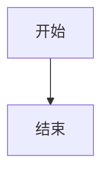
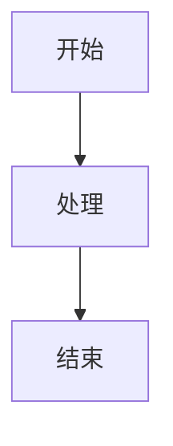

# 测试说明

本文档描述了LAD Markdown Viewer包的测试策略和测试用例。

## 测试策略

### 测试类型

1. **单元测试**: 测试各个模块的独立功能
2. **集成测试**: 测试模块间的协作
3. **功能测试**: 测试完整的用户功能
4. **性能测试**: 测试处理大量数据的性能

### 测试覆盖范围

- Markdown处理器核心功能
- YAML前置元数据解析
- Mermaid图表渲染
- 目录生成和锚点跳转
- 桌面应用界面
- Web应用接口

## 测试环境设置

### 环境要求

```bash
# 安装测试依赖
pip install pytest pytest-cov pytest-html

# 安装开发依赖
pip install -e .
```

### 测试目录结构

```
tests/
├── __init__.py
├── test_markdown_processor.py
├── test_markdown_utils.py
├── test_ladmark_viewer.py
├── test_integration.py
├── test_performance.py
└── fixtures/
    ├── sample_markdown.md
    ├── sample_with_yaml.md
    └── sample_with_mermaid.md
```

## 单元测试

### 1. Markdown处理器测试

```python
# tests/test_markdown_processor.py
import pytest
from lad_markdown_viewer.markdown_processor import MarkdownProcessor

class TestMarkdownProcessor:
    def setup_method(self):
        self.processor = MarkdownProcessor()
    
    def test_basic_markdown_rendering(self):
        """测试基础Markdown渲染"""
        markdown = "# 标题\n\n这是正文"
        html = self.processor.process_markdown(markdown)
        
        assert "<h1>标题</h1>" in html
        assert "<p>这是正文</p>" in html
    
    def test_yaml_front_matter_parsing(self):
        """测试YAML前置元数据解析"""
        markdown = """---
title: 测试文档
author: 测试作者
---

# 内容
"""
        html = self.processor.process_markdown(markdown)
        
        assert "测试文档" in html
        assert "测试作者" in html
        assert "title" in html
        assert "author" in html
    
    def test_mermaid_diagram_rendering(self):
        """测试Mermaid图表渲染"""
        markdown = """# 图表


"""
        html = self.processor.process_markdown(markdown)
        
        assert "mermaid" in html
        assert "graph TD" in html
    
    def test_toc_generation(self):
        """测试目录生成"""
        markdown = """# 标题1

## 标题2

### 标题3

## 标题4
"""
        html = self.processor.process_markdown(markdown)
        
        assert "目录" in html or "Table of Contents" in html
        assert "标题1" in html
        assert "标题2" in html
    
    def test_chinese_character_support(self):
        """测试中文字符支持"""
        markdown = "# 中文标题\n\n这是中文内容"
        html = self.processor.process_markdown(markdown)
        
        assert "中文标题" in html
        assert "中文内容" in html
```

### 2. 工具函数测试

```python
# tests/test_markdown_utils.py
import pytest
from lad_markdown_viewer.markdown_utils import slugify, process_mermaid_diagrams

class TestMarkdownUtils:
    def test_slugify_basic(self):
        """测试基础slugify功能"""
        assert slugify("Hello World") == "hello-world"
        assert slugify("测试标题") == "测试标题"
        assert slugify("Special Characters!@#") == "special-characters"
    
    def test_slugify_chinese(self):
        """测试中文字符slugify"""
        assert slugify("中文标题") == "中文标题"
        assert slugify("中文 标题") == "中文-标题"
    
    def test_process_mermaid_diagrams(self):
        """测试Mermaid图表处理"""
        html_input = """
        <div class="highlight">
            <pre><code class="language-mermaid">graph TD
                A[开始] --> B[结束]</code></pre>
        </div>
        """
        
        result = process_mermaid_diagrams(html_input)
        assert "mermaid" in result
        assert "graph TD" in result
```

### 3. 桌面应用测试

```python
# tests/test_ladmark_viewer.py
import pytest
from PyQt5.QtWidgets import QApplication
from lad_markdown_viewer.ladmark_viewer import LadMark

class TestLadMarkViewer:
    @pytest.fixture(autouse=True)
    def setup_qt(self):
        """设置Qt应用"""
        self.app = QApplication([])
        yield
        self.app.quit()
    
    def test_viewer_creation(self):
        """测试查看器创建"""
        viewer = LadMark()
        assert viewer is not None
        assert viewer.windowTitle() == "LAD Markdown Viewer"
    
    def test_markdown_content_setting(self):
        """测试Markdown内容设置"""
        viewer = LadMark()
        content = "# 测试标题\n\n测试内容"
        viewer.set_markdown_content(content)
        
        # 验证内容已设置（通过检查内部状态）
        assert hasattr(viewer, '_markdown_content')
    
    def test_file_loading(self, tmp_path):
        """测试文件加载"""
        # 创建临时Markdown文件
        md_file = tmp_path / "test.md"
        md_file.write_text("# 测试文件\n\n内容", encoding='utf-8')
        
        viewer = LadMark(str(md_file))
        assert viewer is not None
```

## 集成测试

```python
# tests/test_integration.py
import pytest
from lad_markdown_viewer.markdown_processor import MarkdownProcessor
from lad_markdown_viewer.ladmark_viewer import LadMark

class TestIntegration:
    def test_full_workflow(self):
        """测试完整工作流程"""
        # 创建处理器
        processor = MarkdownProcessor()
        
        # 复杂的Markdown内容
        markdown = """---
title: 集成测试文档
author: 测试用户
date: 2025-06-21
---

# 主标题

## 子标题

这是正文内容。

### 代码示例

```python
print("Hello, World!")
```

### 图表



- 列表项1
- 列表项2

1. 有序列表1
2. 有序列表2
"""
        
        # 处理Markdown
        html = processor.process_markdown(markdown)
        
        # 验证结果
        assert "主标题" in html
        assert "子标题" in html
        assert "测试用户" in html
        assert "mermaid" in html
        assert "print" in html
```

## 性能测试

```python
# tests/test_performance.py
import time
import pytest
from lad_markdown_viewer.markdown_processor import MarkdownProcessor

class TestPerformance:
    def test_large_document_processing(self):
        """测试大文档处理性能"""
        processor = MarkdownProcessor()
        
        # 生成大文档
        large_markdown = self._generate_large_markdown(10000)
        
        start_time = time.time()
        html = processor.process_markdown(large_markdown)
        end_time = time.time()
        
        processing_time = end_time - start_time
        
        # 性能要求：处理10KB文档应在1秒内完成
        assert processing_time < 1.0
        assert len(html) > 0
    
    def _generate_large_markdown(self, lines):
        """生成大Markdown文档"""
        content = []
        for i in range(lines):
            if i % 100 == 0:
                content.append(f"# 标题 {i//100}")
            elif i % 10 == 0:
                content.append(f"## 子标题 {i//10}")
            else:
                content.append(f"这是第 {i} 行内容。")
        
        return "\n\n".join(content)
```

## 运行测试

### 基本测试命令

```bash
# 运行所有测试
pytest

# 运行特定测试文件
pytest tests/test_markdown_processor.py

# 运行特定测试类
pytest tests/test_markdown_processor.py::TestMarkdownProcessor

# 运行特定测试方法
pytest tests/test_markdown_processor.py::TestMarkdownProcessor::test_basic_markdown_rendering
```

### 覆盖率测试

```bash
# 生成覆盖率报告
pytest --cov=lad_markdown_viewer

# 生成HTML覆盖率报告
pytest --cov=lad_markdown_viewer --cov-report=html

# 生成XML覆盖率报告
pytest --cov=lad_markdown_viewer --cov-report=xml
```

### 并行测试

```bash
# 使用多进程运行测试
pytest -n auto

# 指定进程数
pytest -n 4
```

## 持续集成

### GitHub Actions配置

```yaml
# .github/workflows/test.yml
name: Tests

on: [push, pull_request]

jobs:
  test:
    runs-on: ubuntu-latest
    strategy:
      matrix:
        python-version: [3.7, 3.8, 3.9, "3.10"]
    
    steps:
    - uses: actions/checkout@v2
    
    - name: Set up Python ${{ matrix.python-version }}
      uses: actions/setup-python@v2
      with:
        python-version: ${{ matrix.python-version }}
    
    - name: Install dependencies
      run: |
        python -m pip install --upgrade pip
        pip install -r requirements.txt
        pip install pytest pytest-cov pytest-html
    
    - name: Run tests
      run: |
        pytest --cov=lad_markdown_viewer --cov-report=xml
    
    - name: Upload coverage to Codecov
      uses: codecov/codecov-action@v1
      with:
        file: ./coverage.xml
```

## 测试数据

### 测试文件

在 `tests/fixtures/` 目录中提供测试用的Markdown文件：

```markdown
# tests/fixtures/sample_markdown.md
# 示例文档

这是一个用于测试的示例文档。

## 功能测试

- 基础Markdown语法
- 列表渲染
- 代码块

## 代码示例

```python
def hello_world():
    print("Hello, World!")
```

## 表格

| 列1 | 列2 |
|-----|-----|
| 数据1 | 数据2 |
```

## 测试报告

### 生成测试报告

```bash
# 生成HTML测试报告
pytest --html=report.html --self-contained-html

# 生成JUnit XML报告
pytest --junitxml=report.xml
```

### 报告内容

测试报告包含：
- 测试执行结果
- 失败测试详情
- 执行时间统计
- 覆盖率信息

---

**最后更新**：2025-06-21 19:47 